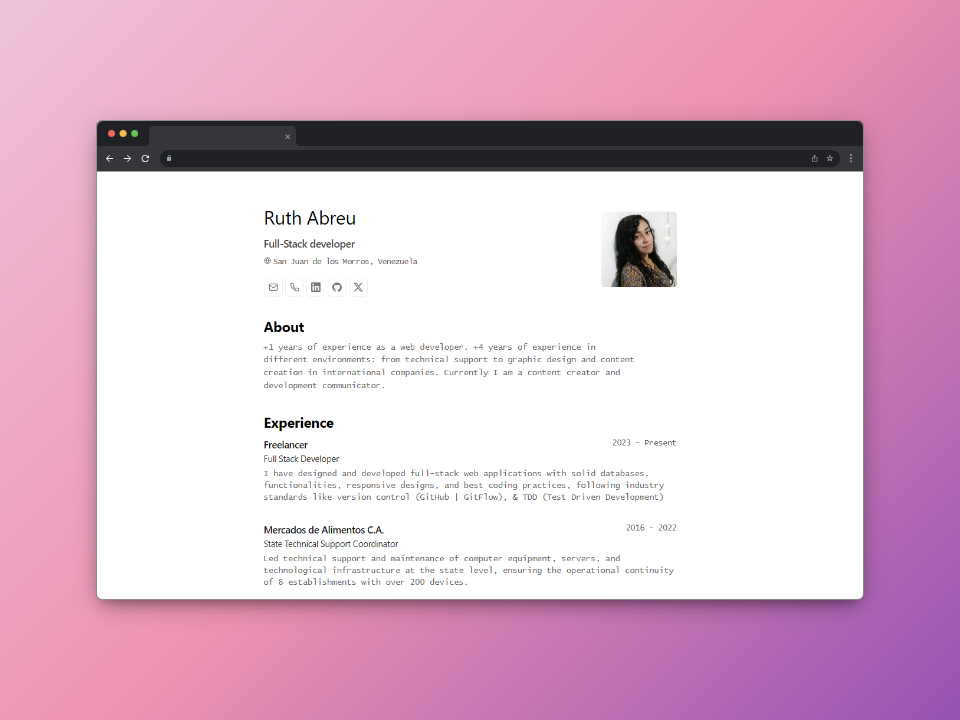

<a name="readme-top"></a>

<div align="center">
    <h1><b><em>Résumé</em> minimalist layout for web and PDF.</b></h1>
</div>

<br>
<div align="center">
</img>


<br>


</div>
<br>
<!-- TABLE OF CONTENTS -->

# 📗 Table of Contents

- [📖 About the Project](#about-project)
  - [🛠 Built With](#built-with)
    - [Tech Stack](#tech-stack)
    <!-- - [🚀 Live Demo](#live-demo) -->
- [💻 Getting Started](#getting-started)
  - [Setup](#setup)
  - [Install](#install)
  - [Prerequisites](#addyourcontent)
  - [Usage](#usage)
- [👥 Authors](#authors)
- [🔭 Future Features](#future-features)
- [🤝 Contributing](#contributing)
- [⭐️ Show your support](#support)
- [🙏 Acknowledgements](#acknowledgements)
- [📝 License](#license)

<!-- PROJECT DESCRIPTION -->

# ✨ Personal Portfolio <a name="about-project"></a>


The main purpose of this repository is to create a simple, eye-catching and fast website to show the projects I have worked on, and the skills acquired in them as part of my work and practice as a FullStack Developer.

<p>
Esquema del JSON de CV de <a href="https://jsonresume.org/schema/">jsonresume.org</a>
</p>

<p>
Basado en el diseño de <a href="https://github.com/BartoszJarocki/cv">Bartosz Jarocki</a>
</p>

<br>

## 🛠 Built With <a name="built-with"></a>

### Tech Stack <a name="tech-stack"></a>

- [**Astro**](https://astro.build/) - The new age web framework.
- [**Typescript**](https://www.typescriptlang.org/) - JavaScript with typing syntax.
- [**Ninja Keys**](https://github.com/ssleptsov/ninja-keys) - Dropdown menu with keyboard shortcuts made in pure Javascript.


<p align="right">(<a href="#readme-top">back to top</a>)</p>

<!-- 
## 🚀 Live Demo <a name="live-demo"></a>
<br>

    [](https://www.loom.com/share/eff934abb4734706b04b3651f8e76e87)

<p align="right">(<a href="#readme-top">back to top</a>)</p> 
-->


<!-- GETTING STARTED -->

## 💻 Getting Started <a name="getting-started"></a>

You can just run this project or use it as a template for your own portfolio.
To get a local copy up and running, follow these steps:

### Setup

Clone this repository to your desired folder by using this 👇️ command :
```
git clone https://github.com/Ruthmy/printable-portafolio.git
```

### Install

Install this project and its dependencies with:

```
 npm install
```

### Add your content

Edit the `cv.json` file to create your own printable portfolio/CV.

### Usage

Now, you can run the project in development mode with:

```
 npm run dev
```

Runs the app in the development mode.
Open http://localhost:4321 to view it in your browser.


<p align="right">(<a href="#readme-top">back to top</a>)</p>

<!-- AUTHORS -->

## 👥 Authors <a name="authors"></a>

👤 **Ruth Abreu**

- GitHub: [@Ruthmy](https://github.com/Ruthmy)
- Twitter: [@rury_exe](https://twitter.com/rury_exe)
- LinkedIn: [LinkedIn](https://linkedin.com/in/ruth-abreu)


<p align="right">(<a href="#readme-top">back to top</a>)</p>

<!-- FUTURE FEATURES -->

## 🔭 Future Features <a name="future-features"></a>

Upcoming improvements:
- [x] Add a dark mode.

<p align="right">(<a href="#readme-top">back to top</a>)</p>

<!-- CONTRIBUTING -->

## 🤝 Contributing <a name="contributing"></a>

Contributions, issues, and feature requests are welcome!

Feel free to check the [issues page](https://github.com/Ruthmy/printable-portafolio/issues).

<p align="right">(<a href="#readme-top">back to top</a>)</p>

<!-- SUPPORT -->

## ⭐️ Show your support <a name="support"></a>

If you like this project and know someone who might find it helpful, please share it.
Or give it a **star** ⭐️


<p align="right">(<a href="#readme-top">back to top</a>)</p>

<!-- ACKNOWLEDGEMENTS -->

## 🙏 Acknowledgments <a name="acknowledgements"></a>

I would like to thank [Midudev](https://github.com/midudev), for his amazing work, for his content and for his guide and inspiration to create this project and many others using and learning technologies that are new to me.

- Based on the design of [Bartosz Jarocki](https://github.com/BartoszJarocki/cv)
- JSON CV schema from [jsonresume.org](https://jsonresume.org/schema/)


<p align="right">(<a href="#readme-top">back to top</a>)</p>


<!-- LICENSE -->

## 📝 License <a name="license"></a>

This project is [MIT](./LICENSE) licensed.


<p align="right">(<a href="#readme-top">back to top</a>)</p>


